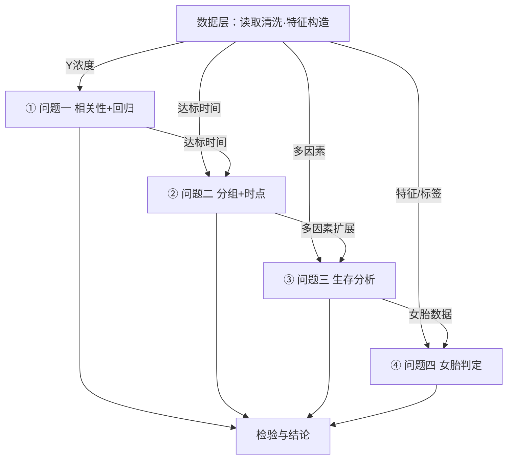

# 整体建模流程图（整体流程 / 技术路线）制作规范与模板

> 依据：2025 C 题（NIPT）实战复盘。问题分析/问题重述中的"整体建模流程"图历经 4 版迭代，最终确定为 v4 方案。**核心教训**：
> ① 整体流程图必须覆盖全部子问题（每问一个阶段框），不得只画某一问的流程冒充（被判"不完整"）；
> ② 所有文字标签必须加白色描边背景（`bbox`），否则文字压箭线/压背景形成"文字遮挡"；
> ③ 框内分项与产出标注之间必须留足间距，白底产出框若覆盖分项文字即为遮挡；
> ④ 窄表/标题文字字号过大、过密均会被判定不美观。

---

## 〇、增强设计规范（2026-08 融合三大绘图 Skill 沉淀）

> 本节把 `diagram-design`（图形语言）、`multi-chart-draw`（多格式工作流）、`scientific-toolkit-skill`（出版级图表）里画图的优秀部分，固化进本 skill 的流程图规范。**v4 模板函数保持不变，这些规范是"画前必读 + 画后必检"。**

### 1. 图形语言（取自 diagram-design：形状承载类型，而非颜色）

| 元素 | 形状 | 用途 |
|------|------|------|
| 起止 | 椭圆（`FancyBboxPatch` + 大 `pad` 圆角） | 开始/结束/目标 |
| 步骤/建模 | 圆角矩形 | 数据层、各问题建模、检验 |
| 决策 | 菱形（`Polygon`） | 关键分支点（≤3 出口，>3 拆嵌套） |
| 汇合 | 实心圆点 | 分支重新合并处 |

- **颜色只做层级/强调，不做类型编码**：同一"类型"的元素形状必须一致，颜色负责表达"哪一步最关键"。
- **焦点规则（Focal rule）**：强调色只给 **1–2 个**最关键元素（如唯一核心决策/唯一结论），其余全部克制配色。全图超过 2 个强调色 = 还没想清楚重点在哪。
- **删除测试**：每画一个盒子问一句"删掉它读者还懂吗？"——两盒永远同时出现就合并成一盒；关系明显到不用画线就去掉线。图的完成标准是"再也删不动"，不是"都画上了"。
- **复杂度预算**：单图盒子 ≤9、箭头 ≤12。超出就拆成"总览 + 详图"两图，绝不硬塞。

### 2. 连接线卫生（取自 diagram-design 五条强制规则）

1. **先画全部箭头，再画盒子**（保证线在盒子下层，穿入处被盖住）——v4 模板沿用此序。
2. **箭头标签与线之间留 6–10px 视觉空隙**：白底 `bbox` 不能贴在线条上，底边与线条至少留 6px；垂直箭头的标签放线侧（不放线上）。
3. **同一边进出的多个箭头必须分锚点**：同一盒子边缘有 N 根箭头时，锚点间距 ≥12px，禁止共享一个点、禁止贴在一起。
4. **禁止交叉/重叠**：两条箭头不得共用路径或互相压盖；非要交叉时用"桥接跳线"，或重排布局。
5. **虚线 = 依赖/反馈，实线 = 主流程**：一图一义，不混用。

### 3. 多格式工作流（取自 multi-chart-draw：先快后精）

- **先出 Mermaid 文本草稿**：定稿前用 Mermaid（见 §三）快速迭代结构，分钟级改动，确认结构后再落 matplotlib 精修。决策分支必须逐条标注（`|是|` / `|否|`），不许有无标签出口。
- **场景选型**：单线流水线 → v4 模板；带决策回路的算法流程 → §四 菱形决策变体；时序交互 → Mermaid Sequence；系统架构 → 复杂时用 DrawIO，简单时 Mermaid。

### 4. 出版级输出（取自 scientific-toolkit-skill）

- **线稿优先矢量**：`savefig` 同时写 **PDF/SVG**（LaTeX 直插）+ **300DPI PNG** 双格式；不提交 JPEG（有损）。v4 模板的 `fig.savefig(save, dpi=300)` 改为双写（见模板）。
- **色盲安全配色**：优先 Okabe-Ito 色板（`#E69F00 #56B4E9 #009E73 #F0E442 #0072B2 #D55E00 #CC79A7`），其中的橙 `#D55E00` 用作强调色。避免红绿对比传达信息。
- **灰度检验**：保存后转灰度目检，保证去色后仍能区分各层/各问。
- **字号体系**：标题 11–13pt / 内容 8–9pt 是一组，全图统一，不与正文抢字。
- **统一风格**：全文所有图的色板/字号/线宽从本文件复制，不另起炉灶（同一论文内图与图风格一致）。

---

## 一、v4 设计规范（本 skill 的标准）

| 设计元素 | 规范 |
|---------|------|
| 面板容器 | 整图套浅灰圆角面板（`FancyBboxPatch`），专业排版、内容归拢 |
| 标题层级 | 大标题 17pt 加粗 + 副标题 11pt（副标题加白底），间距≥0.013 |
| 数据层 | 浅蓝带条（`#DEEBF7` 底 + `#6BAED6` 边），两行：主行（处理流程）+ 次行（数据来源/行数列数） |
| 各问题框 | 每问一个独立色框（蓝/绿/紫/橙 依次），**编号并入标题前缀**（`① 问题一 · 相关性+回归`），避免角标与标题重叠 |
| 框内结构 | 标题 → 3 个模型分项（间距≥0.05）→ **白底虚线产出框**（`产出：关系模型+显著性`），分项下沿与产出框上沿间距≥0.01 |
| 数据流标签 | 数据层→各问箭头带标签（Y浓度/达标时间/多因素/特征标签）；问间横向箭头带链接标签（达标时间/多因素扩展/…） |
| **防遮挡铁律** | **所有文字标签统一 `bbox=dict(facecolor='white', edgecolor='none', alpha=0.9, pad=0.25)`**——标签压箭线、压背景均不遮挡。**升级：标签底边与箭头线之间留 ≥6px 视觉空隙，垂直箭头标签放线侧** |
| 检验层 | 浅珊瑚带条（`#FDEEEC` 底 + `#E3A29B` 边）+ 深灰结论框（`#4A4A4A`），右向箭头衔接 |
| 图例 | 底部：`■数据层 ■各问题建模 ■检验与结论 ──→流向 虚线框=产出物` |
| 输出规格 | `figsize=(12.5, 7.3)`，300 DPI，中文 SimHei 无乱码，`bbox_inches='tight'`；**双写 PDF/SVG（线稿矢量）** |

---

## 二、可复用模板函数（复制进 code/visualization.py 直接可用）

```python
# ---------- 整体建模流程（技术路线）图：v4 标准模板 ----------
def draw_pipeline_flowchart(
        title='整体建模流程', subtitle='数据预处理 → 建模求解 → 模型检验',
        data_layer='数据层：数据读取与清洗  ｜  数据解析/缺失处理  ｜  特征构造',
        data_source='输入：附件.xlsx  ｜  样本量 × 特征数',
        questions=None,        # list[(编号, 问题名, 子题名)]，如 [('①','问题一','相关性+回归'),...]
        items=None,            # list[list[str]]，每问的模型/方法分项
        outputs=None,          # list[str]，每问的产出物标注
        data_arrow_labels=None,   # list[str]，数据层→各问箭头标签
        link_labels=None,      # list[str]，问间链接标签（长度=问数-1）
        validation='模型检验：误差分析  ｜  灵敏度分析  ｜  稳健性检验',
        conclusion='结论输出', save='fig16_整体建模流程.png',
        focal_i=None):         # 焦点规则：高亮第几个问题框（0 起），默认不高亮
    """整体建模流程图 v4：面板容器 + 编号前缀 + 每问产出标注 + 白底标签防遮挡 + 图例
    增强：focal_i 高亮核心问题（粗橙边）；savefig 双写 PDF/SVG + 300DPI PNG"""
    from matplotlib.patches import FancyBboxPatch
    from pathlib import Path
    BBOX = dict(facecolor='white', edgecolor='none', alpha=0.9, pad=0.25)
    C_PANEL_F, C_PANEL_E = '#F7F8FA', '#C9D2DD'
    C_DATA, C_DATA_E, C_DATA_T = '#DEEBF7', '#6BAED6', '#1F4E79'
    C_Q = ['#2166AC', '#2E8B57', '#984EA3', '#E07B00']   # Okabe-Ito 兼容，灰度可分
    C_FOCAL = '#D55E00'                                    # 强调色（色盲安全橙）
    C_VALID, C_VALID_E, C_VALID_T = '#FDEEEC', '#E3A29B', '#8C4A44'
    C_CONC, C_GRAY = '#4A4A4A', '#8A8F98'
    N = len(questions)
    fig, ax = plt.subplots(figsize=(12.5, 7.3))
    ax.axis('off'); ax.set_xlim(0, 1); ax.set_ylim(0, 1)
    ax.add_patch(FancyBboxPatch((0.015, 0.015), 0.97, 0.97, boxstyle="round,pad=0.01",
                                facecolor=C_PANEL_F, edgecolor=C_PANEL_E, linewidth=1.2))
    ax.text(0.5, 0.965, title, ha='center', va='center', fontsize=17, fontweight='bold')
    ax.text(0.5, 0.925, subtitle, ha='center', va='center', fontsize=11, color=C_GRAY, bbox=BBOX)
    # 数据层带条
    ax.add_patch(FancyBboxPatch((0.05, 0.78), 0.90, 0.115, boxstyle="round,pad=0.008",
                                facecolor=C_DATA, edgecolor=C_DATA_E, linewidth=1.5))
    ax.text(0.5, 0.86, data_layer, ha='center', va='center', fontsize=11.5,
            color=C_DATA_T, fontweight='bold')
    ax.text(0.5, 0.815, data_source, ha='center', va='center', fontsize=8.5, color='#5B7FA6')
    # 各问题框：宽度随 N 自适应（复杂度预算：N>5 拆图或缩排）
    gap = 0.035
    box_w = (0.875 - (N - 1) * gap) / N
    box_h, box_y = 0.34, 0.36
    x0 = 0.045
    for i in range(N):
        x = x0 + i * (box_w + gap)
        col = C_FOCAL if i == focal_i else C_Q[i % len(C_Q)]
        ec = C_FOCAL if i == focal_i else 'none'
        lw = 3.0 if i == focal_i else 1.0
        ax.add_patch(FancyBboxPatch((x, box_y), box_w, box_h, boxstyle="round,pad=0.01",
                                    facecolor=col, edgecolor=ec, linewidth=lw, alpha=0.93))
        ax.text(x + box_w / 2, box_y + box_h - 0.05, f'{questions[i][0]} {questions[i][1]} · {questions[i][2]}',
                ha='center', va='center', fontsize=10, color='white', fontweight='bold')
        for si, it in enumerate(items[i]):
            ax.text(x + box_w / 2, box_y + box_h - 0.115 - si * 0.056, it,
                    ha='center', va='center', fontsize=8.6, color='white')
        ax.add_patch(FancyBboxPatch((x + 0.02, box_y + 0.045), box_w - 0.04, 0.048,
                                    boxstyle="round,pad=0.006", facecolor='white', alpha=0.97,
                                    edgecolor=col, linestyle='--', linewidth=1.1))
        ax.text(x + box_w / 2, box_y + 0.069, f'产出：{outputs[i]}', ha='center', va='center',
                fontsize=7.8, color=col, fontweight='bold')
        # 数据层→本框箭头 + 白底标签（标签与线留 6px 空隙，放线上方）
        ax.annotate('', xy=(x + box_w / 2, box_y + box_h + 0.012),
                    xytext=(x + box_w / 2, 0.775),
                    arrowprops=dict(arrowstyle='->', color=C_DATA_E, lw=1.6))
        ax.text(x + box_w / 2, 0.722, data_arrow_labels[i], ha='center', va='center',
                fontsize=7.2, color='#6B7280', bbox=BBOX)
        # 问间链接箭头 + 白底标签
        if i < N - 1:
            ax.annotate('', xy=(x + box_w + 0.026, box_y + box_h / 2),
                        xytext=(x + box_w + 0.004, box_y + box_h / 2),
                        arrowprops=dict(arrowstyle='->', color='#9CA3AF', lw=1.7))
            ax.text(x + box_w + 0.015, box_y + box_h / 2 + 0.055, link_labels[i],
                    ha='center', va='center', fontsize=7.2, color='#6B7280', bbox=BBOX)
    # 检验带条 + 结论
    ax.add_patch(FancyBboxPatch((0.05, 0.12), 0.58, 0.105, boxstyle="round,pad=0.008",
                                facecolor=C_VALID, edgecolor=C_VALID_E, linewidth=1.5))
    ax.text(0.34, 0.1725, validation, ha='center', va='center', fontsize=11,
            color=C_VALID_T, fontweight='bold')
    ax.add_patch(FancyBboxPatch((0.70, 0.12), 0.25, 0.105, boxstyle="round,pad=0.008",
                                facecolor=C_CONC, edgecolor='none', alpha=0.94))
    ax.text(0.825, 0.1725, conclusion, ha='center', va='center', fontsize=11,
            color='white', fontweight='bold')
    for i in range(N):
        x = x0 + i * (box_w + gap)
        ax.annotate('', xy=(x + box_w / 2, 0.245), xytext=(x + box_w / 2, box_y - 0.015),
                    arrowprops=dict(arrowstyle='->', color='#B9BEC6', lw=1.5))
    ax.annotate('', xy=(0.685, 0.1725), xytext=(0.64, 0.1725),
                arrowprops=dict(arrowstyle='->', color='#8A8F98', lw=1.9))
    # 图例（水平底条，不放图内）
    lg_y = 0.045
    for lx, col, lab in [(0.10, C_DATA_E, '数据层'), (0.20, C_Q[0], '各问题建模'),
                         (0.32, C_VALID_E, '检验与结论')]:
        ax.text(lx, lg_y, '■', ha='center', va='center', fontsize=11, color=col)
        ax.text(lx + 0.015, lg_y, lab, ha='left', va='center', fontsize=8.5, color=C_GRAY)
    ax.text(0.45, lg_y, '──→  数据 / 结果流向', ha='left', va='center', fontsize=8.5, color=C_GRAY)
    ax.text(0.86, lg_y, '虚线框 = 每问产出物', ha='left', va='center', fontsize=8.5, color=C_GRAY)
    # 双写：线稿矢量 PDF + 300DPI PNG（不提交 JPEG）
    p = Path(save)
    fig.savefig(save, dpi=300, bbox_inches='tight')
    fig.savefig(str(p.with_suffix('.pdf')), bbox_inches='tight')
    plt.close(fig)
    print(f'[图] {save} (+ {p.with_suffix(".pdf")})')
```

### 调用示例（2025 C 题 4 问）

```python
draw_pipeline_flowchart(
    data_layer='数据层：数据读取与清洗  ｜  孕周解析 / 缺失异常处理  ｜  达标时间计算',
    data_source='输入：附件.xlsx  ｜  男胎 1082 行 × 31 列  ｜  女胎 605 行 × 29 列',
    questions=[('①', '问题一', '相关性 + 回归'), ('②', '问题二', '分组 + 时点优化'),
               ('③', '问题三', '生存分析建模'), ('④', '问题四', '女胎异常判定')],
    items=[['Pearson/Spearman', 'Logistic生长曲线', '混合效应 LMM'],
           ['数据驱动达标时间', 'BMI 区间分割', '期望风险最小化'],
           ['删失数据构造', 'AFT 对数正态', 'Cox 交叉验证'],
           ['SMOTE 不平衡处理', 'LR/RF/XGBoost', '软投票集成']],
    outputs=['关系模型 + 显著性', 'BMI 分组 + 最佳时点', '达标比例曲线 + 时点', '判定规则 + AUC'],
    data_arrow_labels=['Y浓度', '达标时间', '多因素', '特征/标签'],
    link_labels=['达标时间', '多因素扩展', '女胎数据'],
    focal_i=2,                     # 焦点规则：高亮"问题三·生存分析"这一核心题
    save='figures/fig16_整体建模流程.png')
```

---

## 三、Mermaid 快速草稿（先快后精，定稿前用）

> 结构没定之前不要动 matplotlib。先用 Mermaid 把流程、分支、标签摆清楚，改结构分钟级；确认后复制到 v4 模板/菱形变体出正式图。



- 每问一框、数据层到每问一条带标签箭头、问间链接箭头带标签、汇入检验层——与 v4 模板一一对应，便于转换。
- 决策分支必须逐条写标签（`|是|` / `|否|`），不许有无标签出口。
- 子问题 >5 时在此拆"总览 + 详图"，不要硬塞一图。

---

## 四、菱形决策变体（带决策回路 / 分支的算法流程）

> 适用：求解算法伪代码配图、带条件回路的流程图。取自 `diagram-design` 的"形状承载类型"：起止椭圆、步骤矩形、决策菱形、虚线回路。

```python
def draw_algorithm_flowchart(
        title='算法流程', start='开始', end='结束',
        steps=('读取并清洗数据', '模型求解'),      # 顺序步骤（矩形）
        decision='残差检验通过?',                  # 决策条件（菱形）
        yes='是', no='否', result='输出结果',       # 分支标签与出口
        save='fig_算法流程.png'):
    """菱形决策流程图：椭圆起止 / 矩形步骤 / 菱形决策 / 虚线反馈回路 / 白底标签留空"""
    from matplotlib.patches import FancyBboxPatch, Polygon
    from pathlib import Path
    BBOX = dict(facecolor='white', edgecolor='none', alpha=0.9, pad=0.25)
    C_MAIN, C_DEC = '#2166AC', '#D55E00'     # 主流程蓝 + 决策强调橙（焦点规则）
    C_EDGE = '#1F4E79'
    fig, ax = plt.subplots(figsize=(9, 6.5))
    ax.axis('off'); ax.set_xlim(0, 1); ax.set_ylim(0, 1)
    ax.text(0.5, 0.96, title, ha='center', fontsize=14, fontweight='bold')

    def oval(cx, cy, w, h, text):
        ax.add_patch(FancyBboxPatch((cx - w/2, cy - h/2), w, h, boxstyle="round,pad=0.5",
                                    facecolor='#F2F3F5', edgecolor=C_EDGE, linewidth=1.3))
        ax.text(cx, cy, text, ha='center', va='center', fontsize=10)

    def rect(cx, cy, w, h, text):
        ax.add_patch(FancyBboxPatch((cx - w/2, cy - h/2), w, h, boxstyle="round,pad=0.02",
                                    facecolor='white', edgecolor=C_MAIN, linewidth=1.5))
        ax.text(cx, cy, text, ha='center', va='center', fontsize=10)

    def diamond(cx, cy, w, h, text):
        ax.add_patch(Polygon([(cx, cy + h/2), (cx + w/2, cy), (cx, cy - h/2), (cx - w/2, cy)],
                             closed=True, facecolor=C_DEC, edgecolor='#B25E00', linewidth=1.5,
                             alpha=0.92))
        ax.text(cx, cy, text, ha='center', va='center', fontsize=9.5, color='white', fontweight='bold')

    # 布局：椭圆起止 + 步骤矩形（等间距）+ 菱形决策 + 结果盒 + 虚线回路
    oval(0.5, 0.84, 0.18, 0.055, start)
    rect(0.5, 0.68, 0.34, 0.065, steps[0])
    rect(0.5, 0.52, 0.34, 0.065, steps[1])
    diamond(0.5, 0.32, 0.32, 0.13, decision)
    rect(0.5, 0.13, 0.24, 0.06, result)
    oval(0.5, 0.045, 0.18, 0.05, end)
    # 先画全部箭头，后画盒子（本模板盒先画亦可，箭头全部落在行间空隙）
    for y1, y2 in [(0.795, 0.835), (0.715, 0.755), (0.555, 0.595)]:
        ax.annotate('', xy=(0.5, y1), xytext=(0.5, y2),
                    arrowprops=dict(arrowstyle='-|>', color=C_MAIN, lw=2.0))
    # 决策 → 结果（是，向右出口）
    ax.annotate('', xy=(0.685, 0.32), xytext=(0.615, 0.32),
                arrowprops=dict(arrowstyle='-|>', color=C_MAIN, lw=2.0))
    ax.text(0.65, 0.35, yes, ha='center', va='center', fontsize=8.5, color=C_DEC, fontweight='bold')
    # 结果 → 结束
    ax.annotate('', xy=(0.5, 0.175), xytext=(0.5, 0.22),
                arrowprops=dict(arrowstyle='-|>', color=C_MAIN, lw=2.0))
    # 决策 → 回路（否，虚线左绕回步骤，标签放线侧留空隙）
    ax.annotate('', xy=(0.185, 0.52), xytext=(0.30, 0.32),
                arrowprops=dict(arrowstyle='-|>', color='#9CA3AF', lw=1.6, linestyle='--'))
    ax.text(0.20, 0.43, no, ha='center', va='center', fontsize=8.5, color='#6B7280', bbox=BBOX)
    # 双写矢量 + 位图
    p = Path(save)
    fig.savefig(save, dpi=300, bbox_inches='tight')
    fig.savefig(str(p.with_suffix('.pdf')), bbox_inches='tight')
    plt.close(fig)
    print(f'[图] {save} (+ {p.with_suffix(".pdf")})')
```

调用示例：

```python
draw_algorithm_flowchart(
    title='SVR 回归求解流程', start='开始', end='结束',
    steps=('读取孕周-浓度数据', 'SVR 网格搜索 + 交叉验证'),
    decision='R² 满足精度?', yes='是', no='否', result='输出最优模型',
    save='figures/fig17_算法流程.png')
```

---

## 五、适配其他赛题

- **问数 N 任意**：框宽自动按 `box_w=(0.875-(N-1)*gap)/N` 缩放，颜色循环 `C_Q[i % 4]`；N=3 或 N=5 均可用。N>5 拆"总览 + 详图"两图（复杂度预算）。
- **无数据层**：直接删数据带条与箭头，把各问框上移到 y≈0.78 附近。
- **无独立检验层**：删检验带条，结论框改放底部居中。
- **配色**：可换 `C_Q` 为题目配色；保持浅色底 + 深色字、深色底 + 白字的对比原则；新配色过一遍**灰度检验**。
- **带决策回路**：改用 §四 菱形变体；决策分支 ≤3 出口，标签必填（是/否/…）。

## 六、落地检查清单

- [ ] 覆盖全部子问题（每问一框），非单问流程
- [ ] 所有文字标签带白底 `bbox`（防遮挡），且标签与箭头线之间留 ≥6px 空隙
- [ ] 框内分项下沿与产出框上沿间距≥0.01（防白底覆盖文字）
- [ ] 标题/带条字号层级清晰（17/11.5/11/10/8.6/7.8）
- [ ] 焦点规则：强调元素 ≤2 个（`focal_i` 至多 1 处 + 决策菱形）
- [ ] 复杂度预算：盒子 ≤9、箭头 ≤12；超了拆图
- [ ] 形状承载类型：起止椭圆 / 步骤矩形 / 决策菱形，不以颜色标类型
- [ ] 决策分支逐条带标签，无出口
- [ ] 300 DPI + PDF/SVG 双写，中文 SimHei 无乱码，`bbox_inches='tight'`
- [ ] 配色过灰度检验（去色后可区分各层），避免红绿对比传达信息
- [ ] 嵌入 PDF 后人工目检：无文字重叠、无越界、无箭头压字、无交叉缠绕
